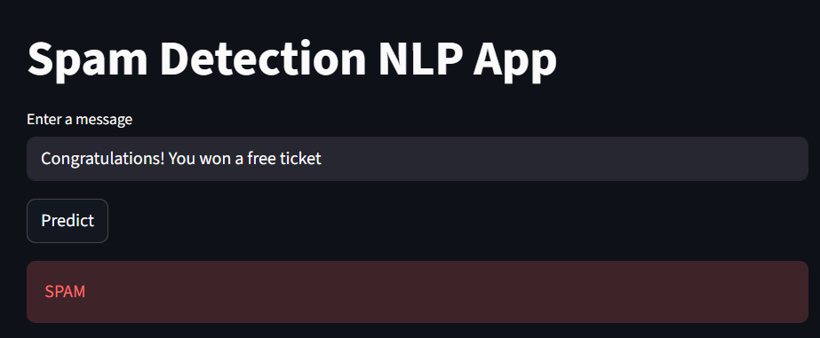

# Spam Detection NLP App

A simple and interactive **Natural Language Processing (NLP)** project that classifies SMS messages as **Spam** or **Not Spam** using machine learning.

This project demonstrates the complete ML workflow — from training a model to deploying it as a web application using **Streamlit**.

---

Live Demo

Try the deployed app here:

https://spam-detection-cwnextbn6tifbiextjyget.streamlit.app

## Example Predictions

### Spam Example


### Not Spam Example


## Project Overview

Spam detection is a classic **text classification problem** in machine learning.
This project uses a **TF-IDF vectorizer** and **Logistic Regression classifier** to detect spam messages.

Pipeline:

```
Text Message → TF-IDF Vectorization → Logistic Regression → Prediction
```

---

## Features

* NLP text classification
* TF-IDF feature extraction
* Logistic Regression model
* Streamlit web interface
* Deployable ML project structure
* Real SMS spam dataset

---

## Dataset

SMS Spam Collection Dataset
[https://raw.githubusercontent.com/justmarkham/pycon-2016-tutorial/master/data/sms.tsv](https://raw.githubusercontent.com/justmarkham/pycon-2016-tutorial/master/data/sms.tsv)

The dataset contains labeled messages:

* **ham** → normal message
* **spam** → unwanted message

---

## Project Structure

```
spam-detection/
│
├── app.py
├── train.py
├── model.pkl
├── requirements.txt
└── README.md
```

---

## Installation

Clone the repository:

```
git clone https://github.com/YOUR_USERNAME/spam-detection.git
cd spam-detection
```

Install dependencies:

```
pip install -r requirements.txt
```

---

## Train the Model

```
python train.py
```

This will generate:

```
model.pkl
```

---

## Run the App

```
streamlit run app.py
```

Then open:

```
http://localhost:8501
```


## Technologies Used

* Python
* scikit-learn
* pandas
* Streamlit
* NLP (TF-IDF)

---

## Learning Goals

This project demonstrates:

* Text preprocessing
* Feature extraction
* Classification models
* ML pipelines

